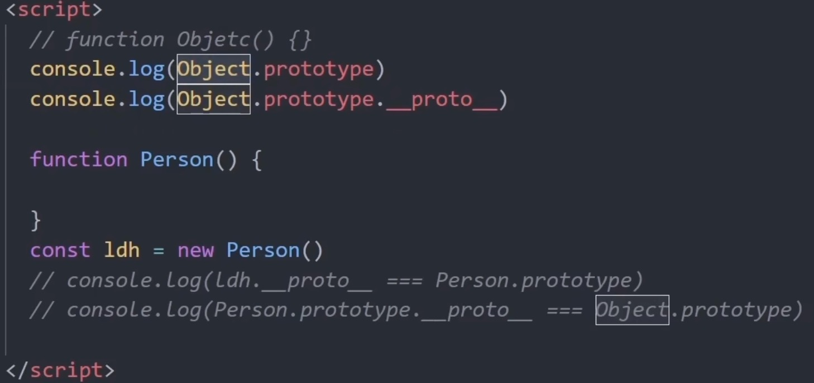
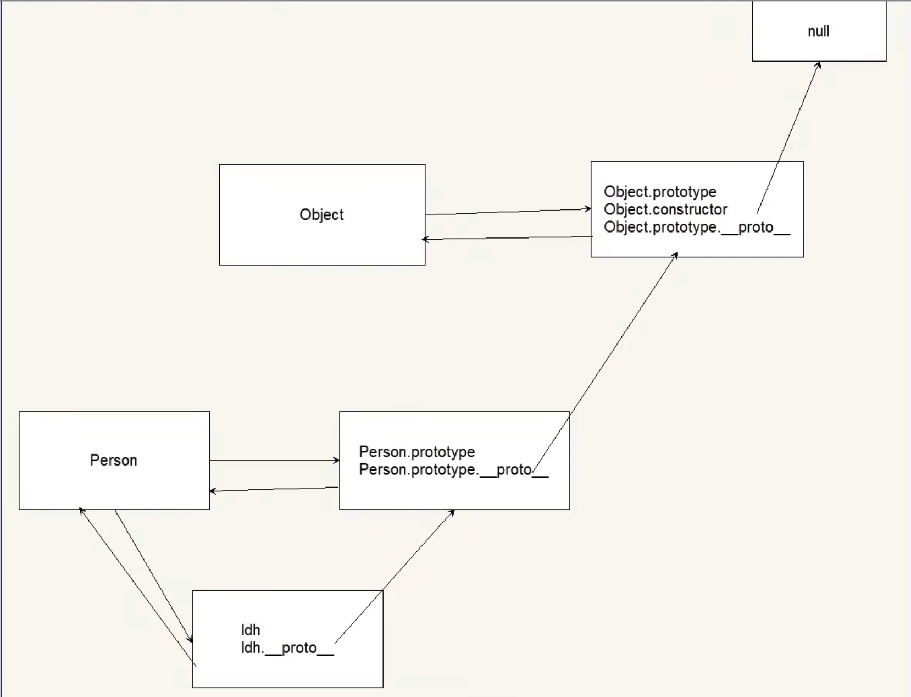

<!--
 * @Date: 2024-01-16 14:36:46
 * @LastEditors: tandongyang =
 * @LastEditTime: 2024-02-28 11:32:44
 * @FilePath: /dongYangTan.github.io/docs/web/js/README.md
-->

## 1.数组splice
splice(start, deleteCount, item1, item2, itemN)  **会对原数组修改**  
splice(开始位置, 要删除的长度, 要添加的元素)  
slice(包含该索引位置的元素, 结束提取元素的索引位置（不包含该索引位置的元素）)  **生成新数组**  
 ```
 const myFish = ["angel", "clown", "mandarin", "sturgeon"];
 const removed = myFish.splice(2, 0, "drum", "guitar"); 
 myFish ： ["angel", "clown", "drum", "guitar", "mandarin", "sturgeon"]
 ------
 let fruits = ['apple', 'banana', 'cherry', 'date'];
 let subArray = fruits.slice(1, 3);
 console.log(subArray); // 输出: ['banana', 'cherry']
 ```

 
## 2.es5和es6区别  
ES5和ES6都是JavaScript语言的版本，ES5在2009年发布，ES6在2015年发布，两者之间有以下的区别：   
1、变量声明方式不同：ES5使用var关键字进行变量声明，而ES6则引入了let和const关键字来声明变量。  
2、块级作用域：在ES5中，只存在全局作用域和函数作用域，而ES6中增加了块级作用域，对于if、for、switch等代码块内部所声明的变量，在外部是不可见的。  
3、箭头函数：ES6中新增了箭头函数，可以更为简洁地定义函数，同时箭头函数没有自己的this，它的this绑定在父级作用域的this上。  
4、字符串模板：ES6中新增了字符串模板功能，可以使用反引号（`）来定义多行文本和嵌入表达式。  
5、类和继承：ES6中引入了class关键字来实现类和继承，使得面向对象编程更加方便。  
6、模块化：ES6中引入了模块化的概念，通过export和import关键字来实现模块的导出和引入。  
7、解构赋值：ES6中引入了解构赋值语法，可以方便地从数组或对象中提取值并赋给变量。  
8、Promise对象：ES6中引入了Promise对象，可以更加优雅地处理异步操作。  
9、其他：ES6还新增了一些新的数据结构和方法，如Set、Map、Symbol等。同时对于函数参数的默认值、rest参数等也进行了增强和优化。  
总之，ES6相对于ES5来说是一个更加完善和现代化的JavaScript版本，提供了更多方便的语法和功能特性，能够使得开发者更加高效和舒适地进行开发工作。  

## 3.判断 js 类型的方式
*1. typeof*
可以判断出'string','number','boolean','undefined','symbol'
但判断 typeof(null) 时值为 'object'; 判断数组和对象时值均为 'object'
*2. instanceof*
原理是构造函数的 prototype 属性是否出现在对象的原型链中的任何位置
```
function A() {}
let a = new A();
a instanceof A     //true,因为 Object.getPrototypeOf(a) === A.prototype;
```

## 4.JS 中 == 和 === 区别是什么？
==比较“值”是否相等 ===比较“值 类型”是否相等
## 5. 什么是事件代理/事件委托？
事件代理/事件委托是利用事件冒泡的特性，将本应该绑定在多个元素上的事件绑定在他们的祖先元素上，尤其在动态添加子元素的时候，可以非常方便的提高程序性能，减小内存空间。

## 6.什么是事件冒泡？什么是事件捕获？
**事件冒泡**是指当一个元素触发了某个事件（例如点击事件），该事件会首先在触发元素上进行处理，然后逐级向上冒泡到它的父元素、祖父元素，一直到达文档根元素（即 window 对象）。在冒泡过程中，如果父元素或祖先元素也绑定了相同类型的事件处理函数，它们也会被依次触发。


```
<div id="parent">
  <div id="child">Click me!</div>
</div>

<script>
const parent = document.getElementById('parent');
const child = document.getElementById('child');

parent.addEventListener('click', () => {
  console.log('Parent clicked!');
});

child.addEventListener('click', () => {
  console.log('Child clicked!');
});
</script>
```


如果点击了子元素 child，事件会首先在子元素上触发，然后冒泡到父元素 parent。因此，控制台会输出以下内容：
```
Child clicked!
Parent clicked!
```


**事件捕获**是与事件冒泡相反的过程。在事件捕获中，事件首先从文档根元素开始传播，然后逐级向下捕获到触发事件的元素。在捕获过程中，如果祖先元素绑定了相同类型的事件处理函数，它们会先于触发元素的事件处理函数被依次触发。

```
<div id="parent">
  <div id="child">Click me!</div>
</div>

<script>
const parent = document.getElementById('parent');
const child = document.getElementById('child');

parent.addEventListener('click', () => {
  console.log('Parent clicked!');
}, true); // 第三个参数为 true，表示使用捕获模式

child.addEventListener('click', () => {
  console.log('Child clicked!');
}, true); // 第三个参数为 true，表示使用捕获模式
</script>
```


```
Parent clicked!
Child clicked!
```

## 7.如何阻止事件冒泡？
w3c的方法是e.stopPropagation()，IE则是使用e.cancelBubble = true。例如：
```
window.event.cancelBubble = true；
e.stopPropagation();
```
return false也可以阻止冒泡。

## 8.如何阻止默认事件？
w3c的方法是e.preventDefault()，IE则是使用e.returnValue = false，比如：

```
function stopDefault( e ) { 
 if ( e && e.preventDefault )         
   e.preventDefault(); //IE中阻止函数器默认动作的方式  
 else          
   window.event.returnValue = false; 
}
```
return false也能阻止默认行为。 


## 9.DOM 事件有哪些阶段？谈谈对事件代理的理解
分为三大阶段：捕获阶段--目标阶段--冒泡阶段  
事件代理简单说就是：事件不直接绑定到某元素上，而是绑定到该元素的父元素上，进行触发事件操作时(例如'click')，再通过条件判断，执行事件触发后的语句(例如'alert(e.target.innerhtml)')  
好处：(1)使代码更简洁；(2)节省内存开销    
如何用原生js给一个按钮绑定两个onclick事件？  
使用addEventListener的方式来绑定多个事件。例如

```
var btn = document.getElementById('btn')
btn.addEventListener('click', fn1)
btn.addEventListener('click', fn2)
function fn1 () {
  console.log('我是方法1')  
}
function fn2 () {
  console.log('我是方法2')  
}

```
## 10.响应事件有哪些？
 onclick鼠标点击某个对象；onfocus获取焦点；onblur失去焦点；onmousedown鼠标被按下等，常用的如下： 
1) 鼠标单击事件（ onclick ）  
2) 鼠标经过事件（ onmouseover ）  
3) 鼠标移开事件（ onmouseout ）   
4) 光标聚焦事件（ onfocus ）   
5) 失焦事件（ onblur ）   
6) 内容选中事件（ onselect ）   
7) 文本框内容改变事件（ onchange ）   
8) 加载事件（ onload ）  
9) 卸载事件（ onunload ）  


## 11.闭包的概念？优缺点？使用场景？
闭包的概念：闭包就是能读取其他函数内部变量的函数。 
1) 避免全局变量的污染
2) 希望一个变量长期存储在内存中（缓存变量）

**缺点：**
1) 内存泄露（消耗）
2) 常驻内存，增加内存使用量

**使用场景：**封装功能时(需要使用私有的属性和方法)，函数防抖、函数节流、函数柯里化、给元素伪数组添加事件需要使用元素的索引值。  

*造成内存泄露的原因*
* 意外的全局变量(在函数内部没有使用var进行声明的变量)
* console.log
* 闭包
* 对象的循环引用
* 未清除的计时器
* DOM泄露(获取到DOM节点之后，将DOM节点删除，但是没有手动释放变量，拿对应的DOM节点在变量中还可以访问到，就会造成泄露)

## 12.什么是window对象? 什么是document对象?
window对象代表浏览器中打开的一个窗口。document对象代表整个html文档。实际上，document对象是window对象的一个属性。

## 13.document.onload和document.ready两个事件的区别
页面加载完成有两种事件，一是ready，表示文档结构已经加载完成（不包含图片等非文字媒体文件），二是onload，指示页面包含图片等文件在内的所有元素都加载完成。

## 14.Js的浅拷贝和深拷贝
浅拷贝只复制指向某个对象的指针，而不复制对象本身，新旧对象还是共享同一块内存。但深拷贝会另外创造一个一模一样的对象，新对象跟原对象不共享内存，修改新对象不会改到原对象。  
*浅拷贝*
```
// 第一层为深拷贝
Object.assign()
Array.prototype.slice()
扩展运算符 ...
```

*深拷贝*
```
JSON.parse(JSON.stringify())
递归函数
function cloneObject(obj) {
  var newObj = {} //如果不是引用类型，直接返回
  if (typeof obj !== 'object') {
    return obj
  }
  //如果是引用类型，遍历属性
  else {
    for (var attr in obj) {
      //如果某个属性还是引用类型，递归调用
      newObj[attr] = cloneObject(obj[attr])
    }
  }
  return newObj
}

```


## 15.什么是跨域？有什么方法解决跨域带来的问题？
跨域需要针对浏览器的同源策略来理解，同源策略指的是请求必须是同一个端口，同一个协议，同一个域名，不同源的客户端脚本在没有明确授权的情况下，不能读写对方资源。
受浏览器同源策略的影响，不是同源的脚本不能操作其他源下面的对象。想要操作另一个源下的对象是就需要跨域。
*常用解决方案：*
* 跨域资源共享（CORS）
* nginx代理跨域
* nodejs中间件代理跨域
* jsonp跨域

## 16.谈谈Cookie的弊端?
（1）Cookie数量和长度的限制。每个domain最多只能有20条cookie，每个cookie长度不能超过4KB，否则会被截掉。  
（2）安全性问题。如果cookie被 人拦截了，那人就可以取得所有的session信息。即使加密也与事无补，因为拦截者并不需要知道cookie的意义，他只要原样转发cookie就可以达到目的了。  
（3）有些状态不可能保存在客户端。例如，为了防止重复提交表单，我们需要在服务器端保存一个计数器。如果我们把这个计数器保存在客户端，那么它起不到任何作用。  

## 17.什么是Cookie 隔离？（或者：请求资源的时候不要带cookie怎么做）
通过使用多个非主要域名来请求静态文件，如果静态文件都放在主域名下，那静态文件请求的时候带有的cookie的数据提交给server是非常浪费的，还不如隔离开。因为cookie有域的限制，因此不能跨域提交请求，故使用非主要域名的时候，请求头中就不会带有cookie数据，这样可以降低请求头的大小，降低请求时间，从而达到降低整体请求延时的目的。同时这种方式不会将cookie传入server，也减少了server对cookie的处理分析环节，提高了server的http请求的解析速度。


## 18.描述一下cookies，sessionStorage和localStorage的区别？
sessionStorage和localStorage是HTML5 Web Storage API提供的，可以方便的在web请求之间保存数据。有了本地数据，就可以避免数据在浏览器和服务器间不必要地来回传递。sessionStorage、localStorage、cookie都是在浏览器端存储的数据，其中sessionStorage的概念很特别，引入了一个“浏览器窗口”的概念。sessionStorage是在同源的同窗口（或tab）中，始终存在的数据。也就是说只要这个浏览器窗口没有关闭，即使刷新页面或进入同源另一页面，数据仍然存在。关闭窗口后，sessionStorage即被销毁。同时“独立”打开的不同窗口，即使是同一页面，sessionStorage对象也是不同的cookies会发送到服务器端。其余两个不会。Microsoft指出InternetExplorer8增加cookie限制为每个域名50个，但IE7似乎也允许每个域名50个cookie。
* Firefox每个域名cookie限制为50个。
* Opera每个域名cookie限制为30个。
* Firefox和Safari允许cookie多达4097个字节，包括名（name）、值（value）和等号。
* Opera允许cookie多达4096个字节，包括：名（name）、值（value）和等号。
* InternetExplorer允许cookie多达4095个字节，包括：名（name）、值（value）和等号。

## 19.localstorage不能手动删除的时候，什么时候过期
除非被清除，否则永久保存 clear()可清除  
sessionStorage 仅在当前会话下有效，关闭页面或浏览器后被清除

## 20.什么是函数柯里化
函数柯里化是把接受多个参数的函数变换成接受一个单一参数（最初函数的第一个参数）的函数，并且返回接受余下的参数而且返回结果的新函数的技术。   
柯里化的目的是，减少代码冗余，以及增加代码的可读性。下面看一个与柯里化有关的经典例子：
```
// 实现一个add方法，使计算结果能够满足类似如下的预期：
// add(1)(2)(3) = 6;
// add(1, 2, 3)(4) = 10;
// add(1)(2)(3)(4)(5) = 15;
var add_currying=function(...rest){
  var sum=0;
  for(let item of rest){
   sum+=item;
  }
  var add_back = (...rest) => {
    for(let item of rest){
      sum+=item;
    }
    return add_back;
 };
 add_back.toString = () => sum;
 return add_back;
}
console.log(add_currying(1,2,3)); //6
console.log(add_currying(1,2)(3,4)); //10
console.log(add_currying(1,2)(3)(4,5)); //15
console.log(add_currying(1)(2)(3)(4)(5)(6)); //21
//打印出来会自动使用toString，即使是写var a=add_currying(1,2,3)也会自动调用此方法（默认将函数语句以字符串打出）
//而为了打印出我们想要的结果我们就需要自己重写toString方法
//如果不用es6的三点运算符就只能使用以前的Array.prototype.slice.call(arguments)方法

```


## 21.js如何处理防抖和节流？
在进行窗口的resize、scroll，输入框内容校验等操作时，如果事件处理函数调用的频率无限制，会加重浏览器的负担，导致用户体验非常糟糕。  
此时我们可以采用debounce（防抖）和throttle（节流）的方式来减少调用频率，同时又不影响实际效果。
**函数防抖（debounce）：**
当持续触发事件时，一定时间段内没有再触发事件，事件处理函数才会执行一次，如果设定的时间到来之前，又一次触发了事件，就重新开始延时。  
如下，持续触发scroll事件时，并不执行handle函数，当1000毫秒内没有触发scroll事件时，才会延时触发scroll事件。
```
function debounce(fn, wait) { 
 var timeout = null; 
 return function() { 
  if(timeout !== null) clearTimeout(timeout);           
  timeout = setTimeout(fn, wait); 
 } 
} 
// 处理函数 
function handle() {      
 console.log(Math.random()); 
} 
// 滚动事件
window.addEventListener('scroll', debounce(handle, 1000)); 函数节流

```


**函数节流（throttle）：**
当持续触发事件时，保证一定时间段内只调用一次事件处理函数。  
节流通俗解释就比如我们水龙头放水，阀门一打开，水哗哗的往下流，秉着勤俭节约的优良传统美德，我们要把水龙头关小点，最好是如我们心意按照一定规律在某个时间间隔内一滴一滴的往下滴。  
如下，持续触发scroll事件时，并不立即执行handle函数，每隔1000毫秒才会执行一次handle函数。
```
var throttle =function(func, delay) { 
 var prev = Date.now(); 
 return function() { 
  var context = this;
  var args = arguments; 
  var now = Date.now(); 
  if (now - prev >= delay) { 
   func.apply(context, args);                           
   prev = Date.now();
  } 
 } 
}
function handle() {              
 console.log(Math.random()); 
}         
window.addEventListener('scroll', throttle(handle, 1000)); 

``` 


## 22.JS里垃圾回收机制是什么，常用的是哪种，怎么处理的？
JS的垃圾回收机制是为了以防内存泄漏，内存泄漏的含义就是当已经不需要某块内存时这块内存还存在着，垃圾回收机制就是间歇的不定期的寻找到不再使用的变量，并释放掉它们所指向的内存。  
JS中最常见的垃圾回收方式是标记清除。  
工作原理：是当变量进入环境时，将这个变量标记为“进入环境”。当变量离开环境时，则将其标记为“离开环境”。标记“离开环境”的就回收内存。  

**工作流程：**

- 垃圾回收器，在运行的时候会给存储在内存中的所有变量都加上标记。  
- 去掉环境中的变量以及被环境中的变量引用的变量的标记。
- 再被加上标记的会被视为准备删除的变量。
- 垃圾回收器完成内存清除工作，销毁那些带标记的值并回收他们所占用的内存空间。  
**那些操作会造成内存泄漏全局变量、闭包、DOM清空或删除时，事件未清除、子元素存在引用**


## 23.解释页面的回流与重绘
>页面的回流（reflow）和重绘（repaint）是浏览器渲染页面时的两个关键概念。  

**回流（reflow）**，也称为布局（layout），是指浏览器根据 DOM 元素的样式和布局计算页面中元素的几何位置和大小的过程。当页面的布局发生改变时，浏览器需要重新计算并更新受影响的元素的位置和大小，这个过程就是回流。

**回流的原因包括：**
- 修改了 DOM 元素的几何属性，例如宽度、高度、位置等。
- 添加、删除、隐藏或改变元素的样式。
- 修改页面的内容，例如文本变化或图片尺寸改变。
- 浏览器窗口的大小发生变化。
- 回流是一种比较昂贵的操作，因为它会涉及重新计算和重新布局页面的元素，会消耗较多的计算资源和时间。

**重绘（repaint）**是指当页面的某些元素需要更新其外观样式，但不影响它们在页面中的布局时，浏览器会重新绘制（repaint）这些元素。换句话说，重绘只是重新绘制元素的外观，而不会改变它们的几何属性和位置。

**重绘的原因包括：**
- 修改了元素的背景颜色、文字颜色、边框颜色等样式。
- 使用 CSS transforms 或 opacity 等属性进行动画效果。
- 相比于回流，重绘的开销较小，因为它只涉及元素的外观绘制，而不需要重新计算布局。

优化页面性能时，需要尽量减少回流和重绘的次数。频繁的回流和重绘会导致页面性能下降，影响用户体验。以下是一些减少回流和重绘的技巧：

- 使用 CSS3 的 transform 属性替代 top、left 等属性来进行元素的位移和动画，因为 transform 属性不会引起回流。
- 使用 position: absolute 或 fixed 对象进行动画，使其脱离文档流，减少回流的范围。
- 使用 requestAnimationFrame 来优化动画效果，浏览器会在下一次重绘前执行动画逻辑。
- 合并多次的 DOM 修改，例如使用文档片段（DocumentFragment）进行批量插入或替换节点。
- 使用 CSS 的 will-change 属性来提前告知浏览器将要发生的样式变化，以便优化渲染。
- 通过合理优化代码和避免不必要的回流和重绘，可以提升页面的性能和用户体验。
 

## 24.JS中的宿主对象与原生对象有何不同？
>宿主对象:这些是运行环境提供的对象。这意味着它们在不同的环境下是不同的。例如，浏览器包含像windows这样的对象，但是Node.js环境提供像Node List这样的对象。  

>原生对象:这些是JS中的内置对象。它们也被称为全局对象，因为如果使用JS，内置对象不受是运行环境影响。  

## 25.js 执行机制、事件循环
JavaScript 语言的一大特点就是单线程，同一个时间只能做一件事。单线程就意味着，所有任务需要排队，前一个任务结束，才会执行后一个任务。如果前一个任务耗时很长，后一个任务就不得不一直等着。  
JavaScript 语言的设计者意识到这个问题，将所有任务分成两种，一种是同步任务（synchronous），另一种是异步任务（asynchronous），在所有同步任务执行完之前，任何的异步任务是不会执行的。  
当我们打开网站时，网页的渲染过程就是一大堆同步任务，比如页面骨架和页面元素的渲染。而像加载图片音乐之类占用资源大耗时久的任务，就是异步任务。  
JS 异步有一个机制，就是遇到宏任务，先执行宏任务，将宏任务放入 Event Queue，然后再执行微任务，将微任务放入 Event Queue，但是，这两个 Queue 不是一个 Queue。    
当你往外拿的时候先从微任务里拿这个回调函数，然后再从宏任务的 Queue 拿宏任务的回调函数。    
**宏任务：**整体代码 script，setTimeout，setInterval  
**微任务：**Promise，process.nextTick

## 26.JS为什么要区分微任务和宏任务
（1）js是单线程的，但是分同步异步  
（2）微任务和宏任务皆为异步任务，它们都属于一个队列  
（3）宏任务一般是：script，setTimeout，setInterval、setImmediate  
（4）微任务：原生Promise  
（5）遇到微任务，先执行微任务，执行完后如果没有微任务，就执行下一个宏任务，如果有微任务，就按顺序一个一个执行微任务  

## 27.减少页面加载时间的方法
优化图片  
图像格式的选择（GIF：提供的颜色较少，可用在一些对颜色要求不高的地方）  
优化css（压缩合并css，如margin-top,margin-left...)    
网址后加斜杠（如www.campr.com/目录，会判断这个“目录是什么文件类型，或者是目录。）    
标明高度和宽度（如果浏览器没有找到这两个参数，它需要一边下载图片一边计算大小，如果图片很多，浏览器需要不断地调整页面。这不但影响速度，也影响浏览体验。当浏览器知道了高度和宽度参数后，即使图片暂时无法显示，页面上也会腾出图片的空位，然后继续加载后面的内容。从而加载时间快了，浏览体验也更好了。）    
减少http请求（合并文件，合并图片）。  
 
## 28.线程与进程的区别
一个程序至少有一个进程，一个进程至少有一个线程。线程的划分尺度小于进程，使得多线程程序的并发性高。  
另外，进程在执行过程中拥有独立的内存单元，而多个线程共享内存，从而极大地提高了程序的运行效率。  
线程在执行过程中与进程还是有区别的。每个独立的线程有一个程序运行的入口、顺序执行序列和程序的出口。  
但是线程不能够独立执行，必须依存在应用程序中，由应用程序提供多个线程执行控制。    
从逻辑角度来看，多线程的意义在于一个应用程序中，有多个执行部分可以同时执行。但操作系统并没有将多个线程看做多个独立的应用，来实现进程的调度和管理以及资源分配。这就是进程和线程的重要区别。  

## 29.为什么利用多个域名来提供网站资源会更有效？
1.CDN缓存更方便  
2.突破浏览器并发限制（一般每个域名建立的链接不超过6个）  
3.Cookieless，节省带宽，尤其是上行带宽一般比下行要慢   
4.对于UGC的内容和主站隔离，防止不必要的安全问题(上传js窃取主站cookie之类的)。正是这个原因要求用户内容的域名必须不是自己主站的子域名，而是一个完全独立的第三方域名。   
5.数据做了划分，甚至切到了不同的物理集群，通过子域名来分流比较省事。这个可能被用的不多。   


**PS:** 关于Cookie的问题，带宽是次要的，安全隔离才是主要的。关于多域名，也不是越多越好，虽然服务器端可以做泛解释，浏览器做dns解释也是耗时间的，而且太多域名，如果要走https的话，还有要多买证书和部署的问题。  


## 30.你如何组织，优化自己的代码？
对内：模块模式；对外：继承  
代码重用  
避免全局变量（命名空间，封闭空间，模块化mvc…）  
拆分函数避免函数过于臃肿   
注释    
前端模块化和组件化  


## 31.JS 中的主要有哪几类错误
***JS有三类的错误:***  
**加载时错误：** 加载web页面时出现的错误(如语法错误)称为加载时错误，它会动态生成错误。  
**运行时错误：** 由于滥用html语言中的命令而导致的错误。  
**逻辑错误：** 这些错误是由于对具有不同操作的函数执行了错误的逻辑而导致的  


## 32.使用 arr.filter(Boolean) 进行过滤
```
const arr = [0, 1, '', 'hello', null, undefined, false, true, NaN];
const filteredArr = arr.filter(Boolean);
console.log(filteredArr);
// 输出: [1, 'hello', true]
```

如果想保留 false 和 0，同时过滤掉其他假值
```
const arr = [false, 0, '', 'hello', null, undefined, true];
const filteredArr = arr.filter(item => item !== null && item !== undefined && item !== '');
console.log(filteredArr);
// 输出: [false, 0, 'hello', true]
```
## 33.两种常见的方法可以解决跨域问题：JSONP和CORS。
1) JSONP（JSON with Padding）：JSONP是一种通过动态添加 script 标签的跨域特性，可以从其他域的服务器获取数据并执行回调函数。JSONP只支持GET请求，并且需要服务器端配合返回合适的响应。使用JSONP时，需要在客户端和服务器端进行相应的配置。  JSONP 存在一些安全隐患，比如可能受到跨站脚本攻击（XSS）等问题  
2) CORS（Cross-Origin Resource Sharing）：CORS是一种基于HTTP头部的机制，允许服务器声明哪些跨域请求是允许的。通过在服务器返回的响应头中包含特定的CORS头部，服务器可以与其他域进行跨域通信。CORS支持各种HTTP请求方法，并提供了更灵活、安全的跨域解决方案。使用CORS时，需要在服务器端进行相应的配置。  
* 关于设置document.domain = "example.com";处理跨域问题的方法是针对相同顶级域名下的不同子域名之间的通信。通过将页面的document.domain属性设置为相同的顶级域名，可以解决跨子域之间的同源策略限制，从而实现跨子域的通信。
#### document.domain 应用
* 单点登录（Single Sign-On）：当一个网站拥有多个子域名时，可以使用 document.domain 属性将不同子域名的文档设置为相同的根域名，从而实现单点登录。这允许用户在一个*子域名登录后，在其他子域名上也被认可为已登录状态，避免了用户在每个子域名上重复登录的问题。
* 跨域通信：当网站的不同子域名之间需要进行跨域通信时，可以使用 document.domain 属性解决同源策略的限制。通过将文档的域名设置为相同的根域名，使得不同子域名之间可以共享 JavaScript 对象、执行函数调用等操作。
* 前端微服务架构：在前端微服务架构中，不同的微服务可能部署在不同的子域名上。使用 document.domain 属性可以解决不同子域名之间的跨域通信问题，使得不同的微服务可以在客户端进行协同工作。


## 34.addEventListener/onclick
addEventListener：适用于添加多个事件监听器，并且能够在事件的不同阶段（捕获、目标、冒泡）上进行处理。提供更灵活和有组织的事件管理。  
onclick：只能为每个元素添加一个事件处理程序，不支持多个处理程序。


## 35. script defer 属性
defer 属性确保 JavaScript 代码在 HTML 解析完成后执行，而不会阻塞页面的渲染过程。这意味着浏览器会并行下载 JavaScript 文件，并在 HTML 解析完成后执行代码。然而，对于图片资源，浏览器会在解析 HTML 过程中按照它们在文档中的顺序逐个下载和显示图片。  
因此，如果页面中存在大量图片资源，而 JavaScript 代码被设置为 defer，那么在 HTML 解析完成时，这些图片资源可能仍在加载中，而 JavaScript 代码已经开始执行。这可能导致 JavaScript 代码对于尚未加载完成的图片资源进行操作，可能会出现问题。  
相反，使用 window.addEventListener("load", () => {}) 来监听 load 事件，可以确保代码在所有资源（包括图片）加载完成后再执行。这样可以避免在 JavaScript 代码执行过程中出现对未加载完成的图片资源的操作。   
综上所述，如果页面中包含大量的图片资源，并且你需要确保 JavaScript 代码在所有资源加载完成后再执行，建议使用 window.addEventListener("load", () => {}) 来监听 load 事件。这样可以确保 JavaScript 代码在所有资源都可用时执行，避免潜在的问题。   
DOMContentLoaded 事件在 HTML 文档解析过程中触发，表示 DOM 已经准备就绪，可以操作 DOM 元素，但页面的其他资源可能尚未加载完成。而 load 事件在所有页面及其相关资源都加载完成后触发，表示整个页面已经可以完全访问和操作。  
    

## 36.offsetWidth 和 clientWidth 是用于获取元素宽度的属性
offsetWidth 是一个只读属性，用于获取元素的外部宽度，包括元素的可见内容宽度、内边距（padding）、边框（border）以及垂直滚动条（如果存在）的宽度    
clientWidth 是一个只读属性，用于获取元素的内容区域宽度，即元素可见内容的宽度，不包括内边距、边框和滚动条的宽度  

## 37.JavaScript
JavaScript 是一种单线程语言，这意味着 JavaScript 引擎在执行 JavaScript 代码时只有一个主线程。这个主线程按照代码的顺序执行，一次只能执行一个任务。  
 
## 38.location navigation history 对象是 JavaScript 中的内置对象
* location.href：返回当前页面的完整 URL。可以通过该属性获取或设置页面的 URL。

* location.protocol：返回当前页面的协议部分，例如 "http:" 或 "https:"。

* location.host：返回当前页面的主机名和端口号部分。

* location.hostname：返回当前页面的主机名部分，不包括端口号。

* location.port：返回当前页面的端口号部分。

* location.pathname：返回当前页面的路径部分，包括初始的斜杠 ("/")。

* location.search：返回当前页面的查询字符串部分，包括问号 ("?")。

* location.hash：返回当前页面的片段标识符部分，包括井号 ("#")。

* location.origin：返回当前页面的协议、主机名和端口号部分。

* navigation.userAgent：返回用户代理字符串，即浏览器发送给服务器的标识信息，包含浏览器和操作系统的信息。

* navigation.appVersion：返回浏览器的版本号。

* navigation.platform：返回运行浏览器的平台，如 "Win32" 或 "MacIntel"。

* navigation.cookieEnabled：返回一个布尔值，表示浏览器是否启用了 cookie。

* navigation.language：返回当前浏览器环境的首选语言，通常是浏览器界面的语言。

* navigation.onLine：返回一个布尔值，表示浏览器是否处于在线状态。

* navigation.javaEnabled()：返回一个布尔值，表示浏览器是否启用了 Java。

* history.length：返回浏览器历史记录中的页面数量。

* history.back()：导航到上一个页面，相当于用户点击浏览器的后退按钮。

* history.forward()：导航到下一个页面，相当于用户点击浏览器的前进按钮。

* history.go(n)：导航到相对于当前页面的第 n 个页面，n 可以是正数、负数或零。

* history.pushState(state, title, url)：向浏览器历史记录中添加一个新的状态，并且不会引发页面的加载。它接受三个参数：state（一个表示新状态的对象），title（新状态的标题，目前大多数浏览器忽略这个参数），url（新状态的 URL）。history.pushState({ page: 1 }, "Page 1", "page1.html"); // 添加新的历史状态

* history.replaceState(state, title, url)：替换当前历史记录中的状态，并且不会引发页面的加载。与 pushState() 方法类似，但是它不会在浏览器历史记录中创建新的条目，而是替换当前的条目。history.replaceState({ page: 2 }, "Page 2", "page2.html"); // 替换当前的历史状态

## 39.JavaScript 中的垃圾回收机制是一种自动管理内存的机制，它负责检测不再使用的对象，并释放其所占用的内存空间，以供后续使
> 标记清除（Mark and Sweep）：
* 当变量进入执行环境时，垃圾回收器会给这个变量加上标记。
* 当变量不再使用时，垃圾回收器会给这个变量加上标记。
* 当垃圾回收器运行时，它会标记所有从根变量（全局对象、当前执行环境的变量）开始可以访问到的变量。
* 在标记完成后，垃圾回收器会清除所有没有标记的变量，释放它们所占用的内存空间。
> 引用计数（Reference Counting）：
* 垃圾回收器会跟踪记录每个对象的被引用次数。
* 当变量引用一个对象时，被引用计数加 1。
* 当变量不再引用一个对象时，被引用计数减 1。
* 当对象的被引用计数为 0 时，表示没有变量引用该对象，垃圾回收器将清除该对象并回收其内存空间。  
**在现代 JavaScript 引擎中，通常使用标记清除算法来进行垃圾回收。引用计数虽然简单，但容易出现循环引用的问题，导致无法正确回收对象。因此，大多数现代 JavaScript 引擎已经转向使用标记清除算法来进行垃圾回收。**  

## 40.闭包（Closure）
闭包（Closure）是指能够访问自己词法作用域之外的变量的函数。换句话说，闭包是在函数内部创建的函数，该函数可以访问外部函数中的变量，并将其保存在内存中，即使外部函数已经执行完毕，闭包仍然可以访问和操作这些变量。
## 41.伪数组
* 类数组结构：伪数组对象通常具有类似数组的结构，即具有通过数字索引访问元素的能力。例如，它们可以使用类似obj[0]的语法来访问元素。
* length属性：伪数组对象通常具有length属性，表示它们包含的元素数量。
* 无数组方法和属性：伪数组对象通常不具有数组对象的原生方法和属性，例如push()、pop()、slice()等方法。它们也不继承自Array原型链。
```
function example() {
    console.log(arguments); // 伪数组对象

    // 将伪数组转换为真正的数组
    const arr = Array.from(arguments);
    console.log(arr); // 真正的数组
}
example(1, 2, 3);
请注意，虽然伪数组对象具有类似数组的特点，但它们并非真正的数组，在某些情况下可能会导致意料之外的行为或错误。因此，在使用伪数组对象时，需要注意其特性和限制，并根据需要进行必要的转换。
```
常见伪数组对象（如函数的arguments对象、DOM元素集合、NodeList对象、HTMLCollection对象），还有一些其他的伪数组对象。  
* 字符串（String）：字符串可以通过索引访问单个字符，具有类似数组的结构和length属性，但不能直接使用数组方法。
```
const str = "Hello";
console.log(str[0]); // "H"
console.log(str.length); // 5
```
* TypedArray：TypedArray是JavaScript中的一组类型化数组，如Int8Array、Uint8Array等。它们也具有类似数组的结构和length属性，但不能直接使用数组方法。
```
const typedArray = new Uint8Array(4);
typedArray[0] = 1;
typedArray[1] = 2;
console.log(typedArray.length); // 4
```
* 具有迭代器接口的对象：一些对象实现了迭代器接口，使得它们可以被迭代（如通过for...of循环遍历）。这些对象虽然不是真正的数组，但可以通过迭代器接口访问它们的元素。
```
const obj = {
  0: 'a',
  1: 'b',
  2: 'c',
  length: 3,
  [Symbol.iterator]: function* () {
    for (let i = 0; i < this.length; i++) {
      yield this[i];
    }
  }
};
for (const item of obj) {
  console.log(item);// "a", "b", "c"
}
```

## 42.原型对象
在 JavaScript 中，每个对象都有一个原型对象（prototype object）。原型对象是一个普通的对象，用于共享属性和方法。
* Object.create() 方法的使用

```
// 定义一个原型对象
const personPrototype = {
  greet: function() {
    console.log('Hello!');
  }
};

// 创建一个对象并指定其原型对象为 personPrototype
const person = Object.create(personPrototype);

person.greet(); // 输出: Hello!
```

* 如何在构造函数中创建原型对象

```
// 构造函数
function Person(name) {
  this.name = name;
}

// 在原型对象上定义方法
Person.prototype.greet = function() {
  console.log('Hello, my name is ' + this.name);
};

// 创建对象实例
var person1 = new Person('Alice');
var person2 = new Person('Bob');

person1.greet(); // 输出: Hello, my name is Alice
person2.greet(); // 输出: Hello, my name is Bob
使用 Person.prototype 来定义原型对象，并将 greet 方法添加到原型对象上。这样，通过构造函数创建的所有对象实例都可以共享 greet 方法，就像类方法一样。  
```
## 43.\_\_proto\_\_ 和 prototype 这两个属性在 JavaScript 中经常容易混淆，因为它们都涉及到对象的原型
* \_\_proto\_\_ 是每个 JavaScript 对象都具有的一个内部属性，用于指向该对象的原型。它是一个非标准的属性，但是在许多浏览器和环境中都被支持。通过 \_\_proto\_\_ 可以直接访问和修改对象的原型。然而，它不推荐在生产代码中使用，因为它不是标准的，并且可能不可靠。

* prototype 是在构造函数上定义的一个属性。当使用 new 关键字创建一个对象时，该对象的 [[ Prototype ]] 属性会被设置为构造函数的 prototype 属性的值。它用于定义构造函数创建的对象实例的原型。我们可以通过构造函数的 prototype 属性来添加方法和属性，这些方法和属性将会在通过该构造函数创建的对象实例中共享。   
在简单的术语中，可以说 \_\_proto\_\_ 是对象自己的原型属性，而 prototype 是构造函数的原型属性。   

**对象原型\_\_proto\_\_指向原型对象 prototype**  
> 只要是对象 就会有\_\_proto\_\_  
> 只要是原型 就会有constructor  

    

    


 Person实例对象的对象原型指向Person的原型对象，顺着原型链，Person的原型对象的对象原型 指向Object的原型对象  

## 44.原型链
原型链是 JavaScript 中实现对象之间继承的机制。每个对象都有一个内部属性 \_\_proto\_\_，它指向该对象的原型。如果一个对象访问某个属性或方法时，在该对象本身找不到时，JavaScript 引擎会沿着原型链向上查找，直到找到该属性或方法或者到达原型链的顶端。 

## 45. 创建一个模态弹窗案例 面向对象思想
```
  <style>
       .divbox {
            position: absolute;
            padding: 20px;
            top: 50%;
            left: 50%;
            transform: translate(-50%, -50%);
            background-color: gray;

        }
  </style>

  <script>

        function Model(title = '', msg = '') {
            this.modelBox = document.createElement('div');
            this.modelBox.className = 'model';
            this.modelBox.innerHTML = `
            <div class='divbox'>
                <div>${title}</div>
                 <div>${msg}</div>
                 <i>关闭X</i>
            </div>`
        }
        Model.prototype.open = function () {
            //判断页面是否已经存在model
            const box = document.querySelector('.model')
            box && box.remove()
            document.body.append(this.modelBox);
            // 等着盒子打开 再绑定关闭事件
            // 这里要箭头函数  要不this然指向的是i
            this.modelBox.querySelector('i').addEventListener('click', () => {
                this.close();
            });
        }
        Model.prototype.close = function () {
            this.modelBox.remove()
        }


        document.querySelector('.delete').addEventListener('click', () => {

            const del = new Model('标题啊', '描述内容');
            del.open()
        })
    </script>

```
## 46.深拷贝 - 递归
```
    <script>
        const obj = {
            uname: 'aaa',
            age: 18,
            hobby: ['足球', '篮球'],
        };
        const o = {};
        function deepCopy(newObj, oldObj) {
            for (const key in oldObj) {
                // 要先写数组 后写对象
                if (oldObj[key] instanceof Array) {
                    newObj[key] = []
                    deepCopy(newObj[key], oldObj[key])
                } else if (oldObj[key] instanceof Object) {
                    newObj[key] = {}
                    deepCopy(newObj[key], oldObj[key])
                } else {
                    newObj[key] = oldObj[key]
                }
            }
        }
        deepCopy(o, obj)

    </script>
```
## 47.深拷贝 - JSON.parse() 和 JSON.stringify() 
```
function deepCopy(obj) {
  return JSON.parse(JSON.stringify(obj));
}
先变为简单数据类型 然后再转对象
```

## 48.深拷贝 - 第三方库（例如 Lodash）的 cloneDeep() 
```
var _ = require('lodash');

var obj1 = { name: 'Alice', age: 25 };
var obj2 = _.cloneDeep(obj1);
obj2.name = 'Bob';

console.log(obj1.name); // 输出: Alice
console.log(obj2.name); // 输出: Bob
```

## 49.this
```
<button id="myButton">Click me</button>

const button = document.getElementById('myButton');
button.addEventListener('click', function() {
  // 这里的`this`指向触发事件的按钮元素 此处如果使用箭头函数 this指向window。
  console.log(this); // 输出<button id="myButton">Click me</button>
});
```


## 50.改变this的指向

* bind()方法

```
const obj = {
  name: 'John',
  sayHello: function() {
    console.log(`Hello, ${this.name}`);
  }
};

const otherObj = {
  name: 'Jane'
};

const boundFunc = obj.sayHello.bind(otherObj);
boundFunc(); // 输出：Hello, Jane
```

* 使用箭头函数

```
const obj = {
  name: 'John',
  sayHello: function() {
    const innerFunc = () => {
      console.log(`Hello, ${this.name}`);
    };
    innerFunc();
  }
};

const otherObj = {
  name: 'Jane'
};

obj.sayHello.call(otherObj); // 输出：Hello, Jane

```

* call()或apply()方法 

```
const obj = {
  name: 'John',
  sayHello: function() {
    console.log(`Hello, ${this.name}`);
  }
};

const otherObj = {
  name: 'Jane'
};

obj.sayHello.call(otherObj); // 输出：Hello, Jane
obj.sayHello.apply(otherObj); // 输出：Hello, Jane
两者区别在于第二个参数 
bind(this的指向，arg1,arg2)  bind()方法创建一个新的函数，并将其this值绑定到指定的对象。它的返回值是一个绑定了指定this值的新函数，需加（）执行函数。
call(this的指向，arg1,arg2)  call()方法会立即调用函数，并指定函数内部的this值。它的返回值是函数的执行结果。
apply(this的指向，[arg1,arg2]) 

call和apply只要使用会立刻调用函数 
但是 bind不会，可以在合适的时机调用
```

## 51.防抖（Debouncing）
用于限制事件触发的频率，当一个事件被触发时，防抖会延迟一段时间（等待时间），如果在这段时间内再次触发了同一事件，则会重新计时。只有当一定时间内没有再次触发事件时，才会执行相应的操作。防抖主要用于处理频繁触发的事件，例如窗口调整大小、滚动等。  
例如：王者荣耀回城  
## 52.截流（Throttling） 
用于限制事件触发的频率。与防抖不同，截流会在一定时间间隔内稳定地执行事件处理函数，而不会重复执行。如果在时间间隔内有多次触发事件的情况，只有第一次触发会立即执行处理函数，后续触发会被忽略，直到时间间隔过去后才会再次执行。  
例如：王者荣耀技能冷却  